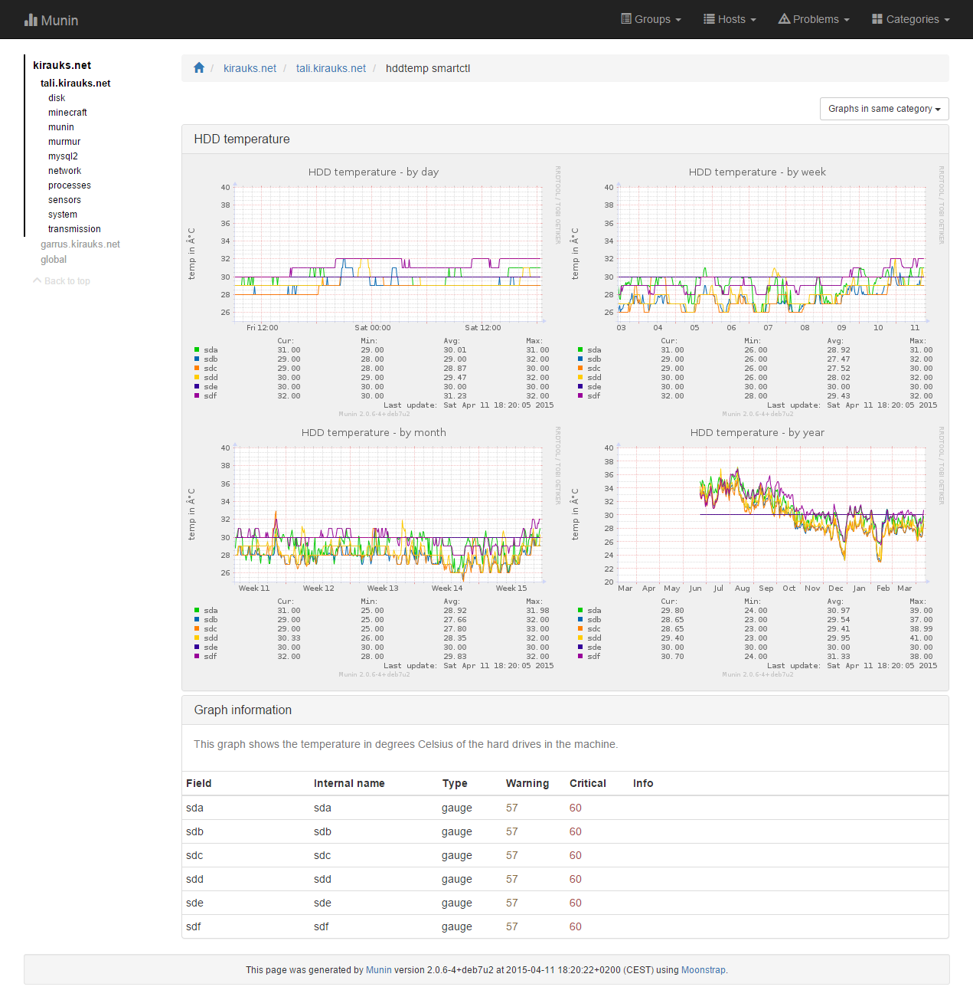
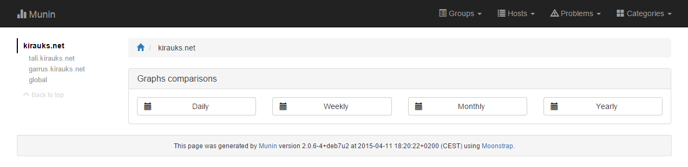

# Moonstrap
Alternative template for [Munin 2.x](http://munin-monitoring.org/) using [Bootstrap 3.3.4](http://getbootstrap.com/).

Still worked on, all improvements ideas and feedbacks are welcome :+1:

- [Overview](#overview)
- [Installation](#installation)
  - [Manual](#manual-dirty-way)
  - [Smooth](#smoother-way)
- [Samples](#samples)
  - [Desktop](#desktop)
  - [Mobile devices](#mobile)

## Overview

**Sample view of a service:**


## Installation

### Manual dirty way

1. Go in the munin configuration directory, usually located in the `/etc/munin/` or in the `/etc/opt/munin/` directory.
2. Replace the `template` and `static` folders and their contents with the ones of Moonstrap. 
3. Wait until Munin regenerates the html pages and enjoy.

### Smoother way

**Prerequisites:**

- Having `git` installed.

**Installation:**

Get Moonstrap:
```
cd /opt
git clone https://github.com/rauks/moonstrap.git
```
Update the `tmpldir` and `staticdir` values in the Munin master configuration in order to use Moonstrap like below (usually located in `/etc/munin/munin.conf`):
```
# Where to look for the HTML templates
#
tmpldir /opt/moonstrap/templates

# Where to look for the static www files
#
staticdir /opt/moonstrap/static
```
Clean the old generated html files (their location depends on the `htmldir` value in the Munin master configuration, assuming it's `/var/www/munin`):
```
rm -rf /var/www/munin/*
```
Wait until Munin regenerates the html pages and enjoy.

**Get upgrades**

Get the latest version of Moonstrap:
```
cd /opt/moonstrap
git pull
```
Wait until Munin regenerates the html pages and enjoy.


**Revert to the stock template:**

To go back to the default template, you can simply comment out the `tmpldir` and `staticdir` values in the Munin master configuration like below:
```
# Where to look for the HTML templates
#
#tmpldir /opt/moonstrap/templates

# Where to look for the static www files
#
#staticdir /opt/moonstrap/static
```

## Samples

### Desktop

**Overview (home):**


**Problems view:**


**Domain view:**



**Node view:**


**Category view (weekly comparison):**


### Mobile

**Overview (home):**


**Domain view:**


**Node view:**


