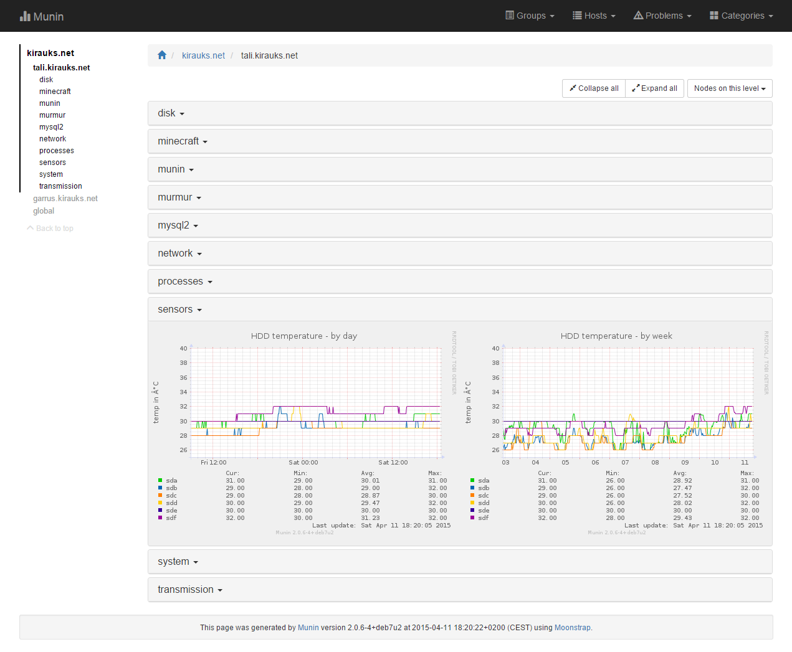

# Moonstrap
Alternative template for [Munin 2.x](http://munin-monitoring.org/) using [Bootstrap 3.3.4](http://getbootstrap.com/).

Still worked on, all improvements ideas and feedbacks are welcome :+1:

- [Overview](#overview)
- [Installation](#installation)
  - [Manual](#manual-way)
  - [Smooth](#smoother-way)
- [Samples](#samples)
  - [Desktop](#desktop)
  - [Mobile devices](#mobile)

## Overview

**Sample view of a service:**


## Installation

### Manual way

1. Go in the munin configuration directory, usually located in the `/etc/munin/` or in the `/etc/opt/munin/` directory.
2. Replace the `template` and `static` folders and their contents with the ones of Moonstrap. 
3. Wait until Munin regenerates the html pages.
4. Enjoy.

### Smoother way

**Prerequisites:**

- Having `git` installed.

**Installation:**

Get Moonstrap:
```
cd /opt
git clone https://github.com/rauks/moonstrap.git
```
Replace the stock template with Moonstrap (assuming that `/etc/munin/` is the location of the Munin configuration). Don't worry, a backup is created thanks to the `-b` option of the `cp` command:
```
cd /etc/munin/
cp -rb /opt/moonstrap/templates .
cp -rb /opt/moonstrap/static .
```
Clean the old generated html files (their location depends on the `htmldir` value in the Munin master configuration, assuming it's `/var/www/munin`):
```
rm -rf /var/www/munin/*
```
Wait until Munin regenerates the html pages and enjoy.

**Get upgrades**

Get the latest version of Moonstrap:
```
cd /opt/moonstrap
git pull
```
Update the Munin files:
```
cd /etc/munin
rm -rf templates static
cp -r /opt/moonstrap/templates .
cp -r /opt/moonstrap/static .
```
Wait until Munin regenerates the html pages and enjoy.


**Revert to the stock template:**

If the `cp` command was correctly used with the `-b` option during the installation, the stock template can be get back:
```
cd /etc/munin
rm -rf templates static
mv templates~ templates
mv static~ static
```

## Samples

### Desktop

**Overview (home):**


**Problems view:**


**Domain view:**


**Node view:**


**Category view:**


### Mobile

